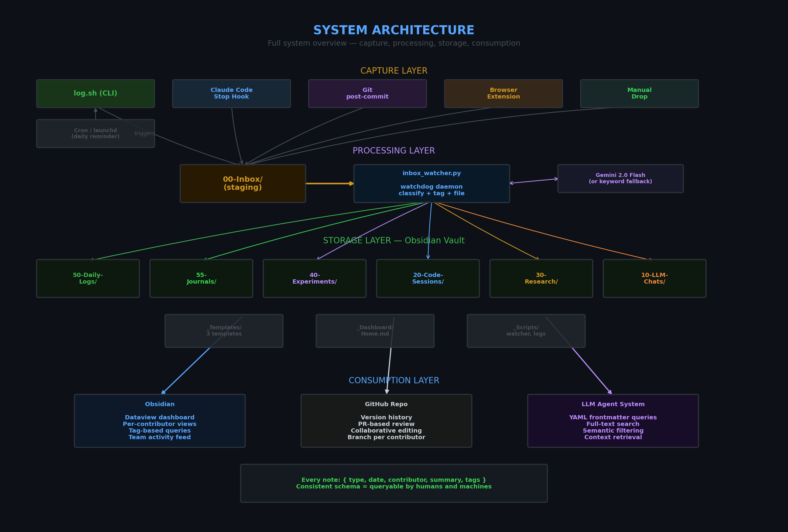
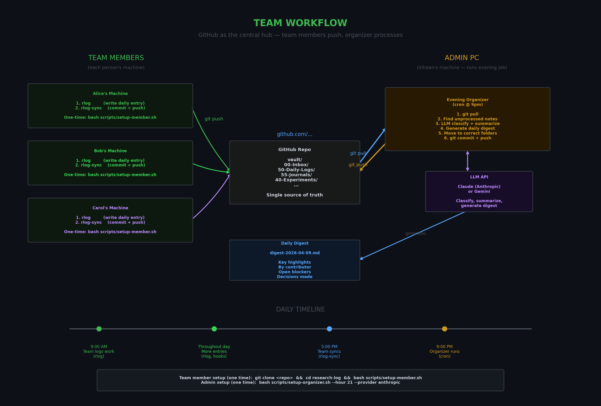
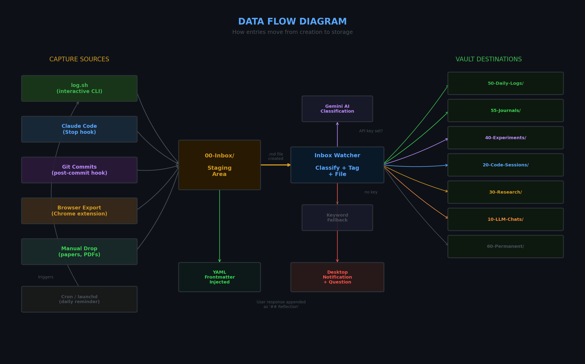
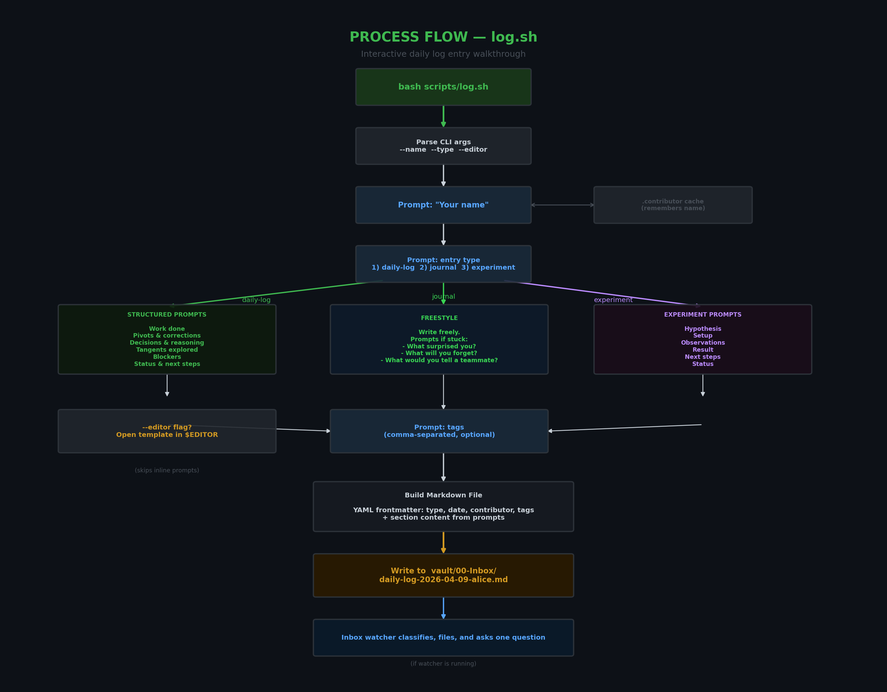
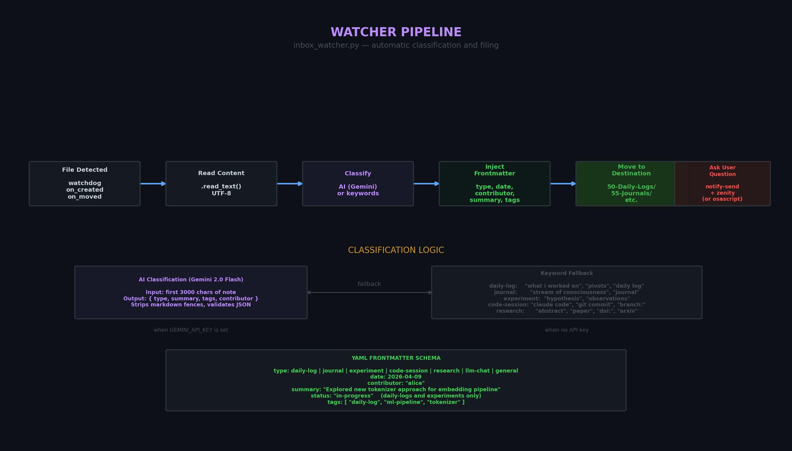

# Research Log

A team daily research logging system built on Obsidian. Collects structured daily logs, freestyle journals, experiments, code sessions, and research notes into a shared vault — one centralized knowledge base for humans today, LLM agents tomorrow.



---

## Table of Contents

- [Quick Start — Team Members](#quick-start--team-members)
- [Quick Start — Admin (Organizer)](#quick-start--admin-organizer)
- [Team Workflow](#team-workflow)
- [How It Works](#how-it-works)
- [Data Flow](#data-flow)
- [Process Flow — log.sh](#process-flow--logsh)
- [Watcher Pipeline](#watcher-pipeline)
- [Evening Organizer](#evening-organizer)
- [Usage Guide](#usage-guide)
  - [Daily Logging (log.sh)](#daily-logging-logsh)
  - [Syncing (sync.sh)](#syncing-syncsh)
  - [Auto-Capture Watcher](#auto-capture-watcher)
  - [Scheduled Reminders](#scheduled-reminders)
  - [Claude Code Hook](#claude-code-session-hook)
  - [Git Commit Hook](#git-commit-hook)
  - [Browser Extension (Claude Web Chats)](#browser-extension-claude-web-chats)
  - [Browser Extension (Web Clipper)](#browser-extension-web-clipper)
  - [Chat Importers Daemon](#chat-importers-daemon)
- [Vault Structure](#vault-structure)
- [Frontmatter Schema](#frontmatter-schema)
- [Obsidian Setup](#obsidian-setup)
- [Environment Variables](#environment-variables)
- [LLM Consumption](#for-llm-consumption)
- [Project Layout](#project-layout)

---

## Quick Start — Team Members

Three commands. No API keys, no dependencies, no config files.

```bash
git clone <repo-url> research-log
cd research-log
bash scripts/setup-member.sh
```

Setup asks your name, creates shell aliases, and optionally sets a daily reminder. Then your daily workflow is:

```bash
rlog              # write your daily log (interactive prompts)
rlog-sync         # commit + push to the shared repo
```

That's it. Everything else happens on the admin PC.

---

## Quick Start — Admin (Organizer)

Run this once on the machine that will process everyone's notes nightly:

```bash
# Install the anthropic SDK
pip install anthropic

# Set your API key
export ANTHROPIC_API_KEY="sk-..."
# Or create a .env file:
echo "ANTHROPIC_API_KEY=sk-..." > .env

# Install the evening cron job (default: 9pm daily)
bash scripts/setup-organizer.sh

# Or use Gemini instead:
bash scripts/setup-organizer.sh --provider gemini
```

The organizer pulls all team entries from GitHub every evening, classifies and summarizes them with an LLM, generates a daily digest, and pushes the organized notes back.

---

## Team Workflow



GitHub is the central hub. Team members push raw entries, the admin's organizer pulls, processes, and pushes back.

```
 TEAM MEMBERS                    GITHUB                     ADMIN PC
 ────────────                    ──────                     ────────
                                    │
 Alice: rlog ──► rlog-sync ──► git push ◄───── git pull ◄── cron @ 9pm
 Bob:   rlog ──► rlog-sync ──► git push         │
 Carol: rlog ──► rlog-sync ──► git push    organizer.py
                                    │        │ classify + summarize
                                    │        │ generate digest
                                    │        │ move to folders
                                git push ◄───┘
                                    │
                              organized vault
                              + daily digest
```

### Daily timeline

| Time | What happens | Who |
|------|-------------|-----|
| Throughout the day | Team members write entries with `rlog` | Everyone |
| End of day | Team members sync with `rlog-sync` | Everyone |
| 9:00 PM (configurable) | Organizer pulls, processes, pushes | Cron on admin PC |
| Next morning | Team pulls latest to see organized notes + digest | Everyone (`rlog-sync --pull`) |

---

## How It Works

Five capture sources, one staging area, one LLM organizer, seven destination folders. Everything is markdown with YAML frontmatter, stored flat.

```
Team member runs rlog ─────────────┐
Claude Code session ──(Stop hook)──┤
Git commit ──(post-commit hook)────┤──► 00-Inbox/ ──(organizer)──► classified & filed
Browser export ────────────────────┤        │                       + daily digest
Manual drop (papers, research)─────┘        ▼
                                       GitHub repo
                                    (central knowledge base)
```

- **Team members write entries** via `rlog` (interactive CLI) and push with `rlog-sync`
- **Hooks capture automatically** from Claude Code sessions and git commits
- **The evening organizer** (cron on admin PC) pulls from GitHub, classifies via LLM (Claude or Gemini), generates a team digest, and pushes organized notes back
- **The inbox watcher** (optional, local) can also process notes in real-time if you prefer
- **Cron/launchd** sends daily reminders to log

---

## Data Flow

How entries move from creation through classification to their final vault location.



### Flow walkthrough

1. **Capture** — An entry is created by one of five sources: the interactive CLI (`log.sh`), a Claude Code session hook, a git post-commit hook, a browser extension export, or a manual file drop
2. **Staging** — The `.md` file lands in `vault/00-Inbox/`, the universal staging area
3. **Detection** — The `inbox_watcher.py` daemon (watchdog-based) detects the new file via filesystem events
4. **Classification** — The watcher classifies the note:
   - **With API key**: Sends the first 3000 characters to Gemini 2.0 Flash, which returns `{ type, summary, tags, contributor }`
   - **Without API key**: Falls back to keyword matching (checks for patterns like "hypothesis", "daily log", "git commit", etc.)
5. **Frontmatter injection** — YAML frontmatter is injected or updated with `type`, `date`, `contributor`, `summary`, and `tags`
6. **Filing** — The note is moved from `00-Inbox/` to its destination folder (e.g., `50-Daily-Logs/`, `55-Journals/`, `40-Experiments/`)
7. **Notification** — A desktop notification appears with one context question (e.g., "Anything you'd add in hindsight?"). The user's response is appended as a `## Reflection` section

---

## Process Flow — log.sh

The interactive CLI that walks team members through a daily entry.



### Step by step

1. **Run** `bash scripts/log.sh` (or with flags: `--name`, `--type`, `--editor`)
2. **Name prompt** — asks your name (cached in `.contributor` so you only type it once)
3. **Type selection** — pick from three entry types:
   - **daily-log** (structured): prompted through Work Done, Pivots, Decisions, Tangents, Blockers, Status
   - **journal** (freestyle): write freely with creative prompts if stuck
   - **experiment**: prompted through Hypothesis, Setup, Observations, Result, Next Steps
4. **`--editor` mode** — if the flag is set, opens the template in `$EDITOR` instead of inline prompts
5. **Tags** — comma-separated, optional (defaults to the entry type)
6. **Build** — assembles the markdown file with YAML frontmatter + section content
7. **Write** — saves to `vault/00-Inbox/<type>-<date>-<name>.md`
8. **Watcher** — if running, picks it up and files it automatically

---

## Watcher Pipeline

The `inbox_watcher.py` daemon — how notes are automatically processed after they land in the inbox.



### Pipeline stages

| Stage | What happens |
|-------|-------------|
| **File Detected** | `watchdog` fires `on_created` or `on_moved` for any new `.md` file in `00-Inbox/` |
| **Read Content** | File content is read as UTF-8 |
| **Classify** | AI classification via Gemini 2.0 Flash (or keyword fallback if no API key) extracts type, summary, tags, and contributor |
| **Inject Frontmatter** | YAML frontmatter is injected or updated. Existing frontmatter from `log.sh` is respected — only summary is updated |
| **Move to Destination** | File is moved to the appropriate folder. Filename collisions are handled with a timestamp suffix |
| **Ask User Question** | Desktop notification + dialog box with one targeted question. Response appended as `## Reflection` |

### Classification keywords (fallback mode)

| Type | Triggers on |
|------|------------|
| `daily-log` | "what i worked on", "pivots", "course correction", "daily log" |
| `journal` | "stream of consciousness", "journal" |
| `experiment` | "hypothesis", "observations", "result:" |
| `code-session` | "claude code", "git commit", "branch:" |
| `research` | "abstract", "paper", "doi:", "arxiv" |
| `llm-chat` | "chat", "prompt", "llm", "claude", "gemini" |
| `general` | anything else |

---

## Evening Organizer

The `organizer.py` script runs nightly on the admin PC via cron. It's the thing that turns raw team entries into an organized knowledge base.

### What it does

| Step | Action |
|------|--------|
| 1. `git pull` | Fetch all team entries pushed during the day |
| 2. Find unprocessed | Scan `00-Inbox/` and find notes with empty summaries |
| 3. LLM classify | Send each note to Claude (or Gemini) for type, summary, tags |
| 4. Update frontmatter | Inject/update YAML frontmatter, preserve existing fields |
| 5. Move to folders | Route each note to the correct destination folder |
| 6. Generate digest | Create a daily team digest with highlights, per-contributor summaries, blockers |
| 7. `git commit + push` | Push organized notes + digest back to the repo |

### Running manually

```bash
# Default (uses Anthropic Claude)
python3 scripts/organizer.py

# Preview without changes
python3 scripts/organizer.py --dry-run

# Organize but don't push
python3 scripts/organizer.py --no-push

# Use Gemini instead
python3 scripts/organizer.py --provider gemini
```

### Installing the cron job

```bash
# Default: 9pm daily, Anthropic
bash scripts/setup-organizer.sh

# Custom time and provider
bash scripts/setup-organizer.sh --hour 21 --minute 30 --provider gemini

# Remove
bash scripts/setup-organizer.sh --remove
```

The setup script generates a wrapper (`run-organizer.sh`) that handles conda activation and loading API keys from `.env`.

### API key setup

Create a `.env` file in the project root (gitignored):

```bash
ANTHROPIC_API_KEY=sk-ant-...
# or
GEMINI_API_KEY=AIza...
```

Or export in your shell profile.

### Daily digest

The organizer generates `vault/50-Daily-Logs/digest-YYYY-MM-DD.md` each evening:

```markdown
## Key Highlights
- 3-5 bullet points of the most important things across all entries

## By Contributor
- Alice: worked on X, decided Y
- Bob: explored Z, blocked on W

## Open Questions & Blockers
- Items needing attention

## Decisions Made
- Pivots and choices noted today
```

---

## Usage Guide

### Daily Logging (log.sh)

The primary way team members log their work.

```bash
# Fully interactive — prompts for everything
bash scripts/log.sh

# Pre-fill your name (remembered after first use)
bash scripts/log.sh --name alice

# Jump straight to a freestyle journal
bash scripts/log.sh --type journal

# Structured daily log opened in your editor
bash scripts/log.sh --type daily-log --editor

# Experiment log
bash scripts/log.sh --type experiment

# Combine flags
bash scripts/log.sh --name bob --type journal --editor
```

#### Entry types

**Structured daily log** (`--type daily-log`):
```
What did you work on today?
Any pivots or course corrections?
Key decisions & reasoning
Tangents explored
Blockers & open questions
Status & next steps
Links & references
```

**Freestyle journal** (`--type journal`):
```
Write freely. Prompts if stuck:
  - What surprised you today?
  - What's the thing you'll forget by next week?
  - What would you tell a teammate picking this up cold?
  - What's the dumbest thing you tried that almost worked?
```

**Experiment** (`--type experiment`):
```
Hypothesis
Setup
Observations
Result
Next steps
Status
```

---

### Syncing (sync.sh)

Push your entries to the shared repo.

```bash
# Commit local entries and push
rlog-sync

# Or manually:
bash scripts/sync.sh

# Pull latest only (get organized notes + digests)
bash scripts/sync.sh --pull
```

`sync.sh` does: `git pull --rebase` → stage `vault/` → commit with your name and date → push. Only vault files are committed — scripts and config are untouched.

---

### Auto-Capture Watcher

Optional local daemon that classifies and files notes in real-time. Most teams won't need this — the evening organizer handles it.

```bash
# Start (keyword classification — no API key needed)
bash scripts/start_watcher.sh

# Start with AI classification
export GEMINI_API_KEY="your-key"
bash scripts/start_watcher.sh

# Stop
bash scripts/stop_watcher.sh
```

The watcher is optional. Without it, entries still land in `vault/00-Inbox/` and you can file them manually or browse them directly in Obsidian.

Logs: `vault/_Scripts/watcher.log`

#### Auto-start on login

Add to `~/.bashrc` or `~/.zshrc`:

```bash
export GEMINI_API_KEY="your-key"  # optional
bash /path/to/research-log/scripts/start_watcher.sh
```

---

### Scheduled Reminders

Daily cron job (Linux) or launchd agent (macOS) that reminds you to log.

```bash
# Default: daily notification at 5:00 PM
bash scripts/setup-cron.sh

# Custom time (24h format)
bash scripts/setup-cron.sh --hour 18 --minute 30

# Also open a terminal with log.sh (not just a notification)
bash scripts/setup-cron.sh --open

# Remove the reminder
bash scripts/setup-cron.sh --remove
```

| Platform | Mechanism | Notification | Terminal |
|----------|-----------|-------------|----------|
| **Ubuntu/Linux** | crontab + `notify-send` | `notify-send` (handles DISPLAY/DBUS from cron) | gnome-terminal, xfce4-terminal, konsole, or x-terminal-emulator |
| **macOS** | launchd plist | `osascript` notification with sound | Terminal.app via AppleScript |

---

### Claude Code Session Hook

Automatically logs every Claude Code session when it ends.

**Install:**

```bash
mkdir -p ~/.claude/hooks
cp hooks/obsidian_logger.sh ~/.claude/hooks/
chmod +x ~/.claude/hooks/obsidian_logger.sh
```

**Register in `~/.claude/settings.json`:**

```json
{
  "hooks": {
    "Stop": [
      {
        "hooks": [
          {
            "type": "command",
            "command": "bash ~/.claude/hooks/obsidian_logger.sh"
          }
        ]
      }
    ]
  }
}
```

If `~/.claude/settings.json` already exists, merge only the hooks block:

```bash
jq '. * {"hooks":{"Stop":[{"hooks":[{"type":"command","command":"bash ~/.claude/hooks/obsidian_logger.sh"}]}]}}' \
  ~/.claude/settings.json > /tmp/s.json && mv /tmp/s.json ~/.claude/settings.json
```

**What gets captured:**
- Session ID
- Repository name and branch
- First 5 user prompts from the transcript
- Files changed in the last commit
- Contributor name (from `git config user.name` or `$LOG_CONTRIBUTOR`)

---

### Git Commit Hook

Logs every git commit from repos you instrument.

**Install per repo:**

```bash
cp scripts/git-post-commit-hook.sh /path/to/repo/.git/hooks/post-commit
chmod +x /path/to/repo/.git/hooks/post-commit
```

**What gets captured:**
- Repo name, branch, commit hash, commit message
- Files changed
- Contributor (git author name)

---

### Browser Extension (Claude Web Chats)

1. Chrome Web Store > search **"Claude to Obsidian & Markdown Export"**
2. Install and open its settings
3. Set the download folder to `vault/00-Inbox/`
4. Enable bulk export

Exported chats land in `00-Inbox/` and the watcher files them to `10-LLM-Chats/`.

---

### Browser Extension (Web Clipper)

Lightweight capture of web content (text selections, links, optional screenshots).

**Install:**
1. Open Chrome → `chrome://extensions/`
2. Enable Developer mode
3. Click "Load unpacked" → select the `extension/` folder
4. Click the extension icon → click gear icon
5. Set "Download Folder" to `<vault-path>/00-Inbox`
6. Click "Save Settings"

**Usage:**
- Select text on any web page (or skip to capture full context)
- Click extension icon → popup appears
- (Optional) toggle "Include screenshot"
- (Optional) add notes and tags
- Click "Save to Research Log"
- File lands in `00-Inbox/` → organizer files to `15-Web-Clips/`

**Files:**
- Extension source: `extension/`
- Setup guide: `docs/extension-setup.md`

---

### Chat Importers Daemon

Auto-collect chat histories from Claude CLI, Copilot, and other tools.

**Install:**
```bash
bash scripts/setup-organizer.sh --enable-importers --importer-interval 2h
```

**How it works:**
- Runs every N hours (configurable, default 2h)
- Scans local storage for new chats from Claude CLI and Copilot
- Converts each to markdown and writes to `00-Inbox/`
- Existing organizer picks up and files to `10-LLM-Chats/`
- State tracking (SQLite) prevents duplicates

**Supported tools:**
- Claude CLI (detects `~/.claude/chats/`)
- Copilot (cross-platform: Windows, macOS, Linux)
- Extensible: add ChatGPT, Gemini, etc.

**Configuration:**
- `--enable-importers` — Install the importers daemon
- `--importer-interval` — How often to run: `30m`, `1h`, `2h`, `6h`, `12h`, `24h` (default: `2h`)

**Manage:**
```bash
# View importer logs
tail -f vault/_Scripts/importers.log

# Re-run manually
python3 scripts/chat_importers.py

# Remove importers
bash scripts/setup-organizer.sh --remove
```

**Files:**
- Importers source: `scripts/chat_importers/`
- Setup integration: `scripts/setup-organizer.sh`
- Dev guide: `docs/importer-developer-guide.md`

---

## Vault Structure

```
vault/
├── 00-Inbox/           ← staging area — everything lands here first
├── 10-LLM-Chats/       ← Claude web chats (via browser extension)
├── 15-Web-Clips/       ← web content captures (via web clipper)
├── 20-Code-Sessions/   ← Claude Code sessions + git commits
├── 30-Research/        ← papers, articles, PDF exports
├── 40-Experiments/     ← hypotheses, test logs, results
├── 50-Daily-Logs/      ← structured daily entries
├── 55-Journals/        ← freestyle journals
├── 60-Permanent/       ← evergreen / general notes
├── _Dashboard/         ← Home.md (Dataview queries)
├── _Scripts/           ← watcher PID, logs
└── _Templates/         ← daily-log.md, journal.md, experiment.md
```

### Folder routing

| Note type | Destination | Created by |
|-----------|-------------|------------|
| `daily-log` | `50-Daily-Logs/` | `log.sh`, manual |
| `journal` | `55-Journals/` | `log.sh`, manual |
| `experiment` | `40-Experiments/` | `log.sh`, manual |
| `code-session` | `20-Code-Sessions/` | Claude Code hook, git hook |
| `research` | `30-Research/` | Manual drop |
| `llm-chat` | `10-LLM-Chats/` | Browser extension, chat importers |
| `web-clip` | `15-Web-Clips/` | Web clipper extension |
| `general` | `60-Permanent/` | Anything unclassified |

---

## Frontmatter Schema

Every note in the vault has YAML frontmatter that makes it queryable:

```yaml
---
type: daily-log                    # daily-log | journal | experiment | code-session | research | llm-chat | web-clip | general
date: 2026-04-09                   # ISO date
contributor: "alice"               # who wrote this
summary: "Explored new approach"   # one-liner, max 120 chars
status: "in-progress"              # for daily-logs and experiments (optional)
tool: "claude-cli"                 # for importers: claude-cli, copilot, etc. (optional)
source_id: "chat-id-123"           # unique ID from source tool (optional)
url: "https://example.com"         # source URL for web clips (optional)
tags:                              # for filtering and search
  - "daily-log"
  - "ml-pipeline"
  - "tokenizer"
---
```

### Code session frontmatter (additional fields)

```yaml
---
type: code-session
date: 2026-04-09
contributor: "alice"
repo: research-log
branch: main
session_id: a1b2c3d4
summary: ""
tags:
  - "code-session"
---
```

---

## Obsidian Setup

1. Open Obsidian
2. **Open folder as vault** > select the `vault/` directory
3. Install **Dataview** plugin: Settings > Community Plugins > Browse > search "Dataview" > Install > Enable
4. Open `_Dashboard/Home.md` — this is your team activity dashboard

Optional: install **Obsidian Git** for automatic vault backup to the repo.

### Dashboard queries

`Home.md` provides live Dataview tables:

| Section | What it shows |
|---------|--------------|
| Recent Daily Logs | Last 10 daily logs with contributor, summary, status |
| Recent Journals | Last 10 journals with contributor and tags |
| Open Experiments | Experiments not marked as done/completed |
| Team Activity (7 days) | All entries from the past week |
| By Contributor | Entry count and last active date per person |
| Recent Code Sessions | Last 8 sessions with repo and branch |
| Recent Research | Last 8 research notes |
| Recent LLM Chats | Last 8 chat exports |

---

## Environment Variables

| Variable | Purpose | Default | Who needs it |
|----------|---------|---------|-------------|
| `ANTHROPIC_API_KEY` | LLM classification in the organizer | required for organizer | Admin only |
| `GEMINI_API_KEY` | Alternative LLM provider | required if `--provider gemini` | Admin only |
| `VAULT_PATH` | Path to the vault directory | `./vault` (relative to project root) | Optional |
| `LOG_CONTRIBUTOR` | Override contributor name in hooks | `git config user.name` or `whoami` | Optional |
| `EDITOR` | Editor for `--editor` mode in log.sh | `vim` | Optional |

API keys can be set in a `.env` file at the project root (gitignored) or exported in your shell.

---

## For LLM Consumption

The vault is designed to be machine-readable from day one:

- **Consistent YAML frontmatter** on every note — `type`, `date`, `contributor`, `summary`, `tags`
- **Typed entries** with predictable section headers (not free-form soup)
- **Contributor attribution** on everything — agent can filter by person
- **Tags** for semantic filtering without parsing body text
- **Flat folder structure** — no nested hierarchies to traverse, just 7 top-level folders
- **Markdown body** — trivially parseable, no binary formats

### Example agent queries

```
"Show me all decisions alice made last week"
→ Filter 50-Daily-Logs/ by contributor=alice, date >= 7 days ago, extract "## Key decisions & reasoning"

"What experiments are still running?"
→ Filter 40-Experiments/ by status != done, return hypothesis + result

"What research has been done on tokenizers?"
→ Full-text search across 30-Research/ for "tokenizer", return summaries

"Summarize team activity for the standup"
→ All notes from today across all folders, group by contributor, extract summaries
```

---

## Project Layout

```
research-log/
├── README.md                        ← this file
├── .gitignore
├── .env                             ← API keys (create this, gitignored)
├── docs/
│   ├── architecture.png             ← system architecture diagram
│   ├── data-flow.png                ← data flow diagram
│   ├── process-flow.png             ← log.sh process flow
│   ├── watcher-pipeline.png         ← watcher pipeline diagram
│   ├── team-workflow.png            ← team GitHub workflow diagram
│   └── gen_diagrams.py              ← script that generates the PNGs
├── scripts/
│   ├── log.sh                       ← interactive daily log CLI
│   ├── sync.sh                      ← commit + push entries to GitHub
│   ├── setup-member.sh              ← one-time team member setup
│   ├── organizer.py                 ← evening LLM organizer (admin PC)
│   ├── setup-organizer.sh           ← install organizer cron/launchd
│   ├── inbox_watcher.py             ← real-time watchdog daemon (optional)
│   ├── start_watcher.sh             ← start watcher as background daemon
│   ├── stop_watcher.sh              ← stop watcher
│   ├── setup-cron.sh                ← install daily reminder (cron/launchd)
│   ├── remind.sh                    ← reminder notification script
│   └── git-post-commit-hook.sh      ← per-repo git hook
├── hooks/
│   └── obsidian_logger.sh           ← Claude Code Stop hook
├── dashboard/
│   ├── Home.md                      ← Dataview dashboard
│   └── SETUP.md                     ← setup guide
└── vault/                           ← open this as your Obsidian vault
    ├── 00-Inbox/
    ├── 10-LLM-Chats/
    ├── 20-Code-Sessions/
    ├── 30-Research/
    ├── 40-Experiments/
    ├── 50-Daily-Logs/               ← daily logs + team digests
    ├── 55-Journals/
    ├── 60-Permanent/
    ├── _Dashboard/
    │   ├── Home.md
    │   └── SETUP.md
    ├── _Scripts/
    └── _Templates/
        ├── daily-log.md
        ├── journal.md
        └── experiment.md
```
