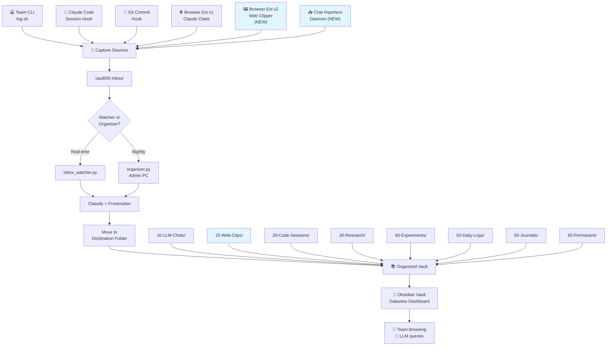
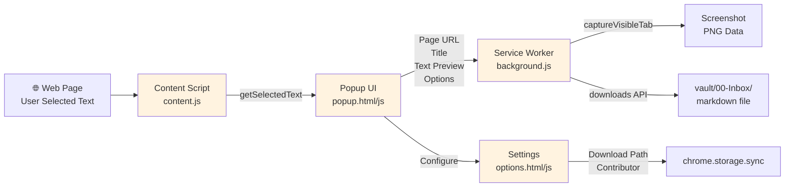
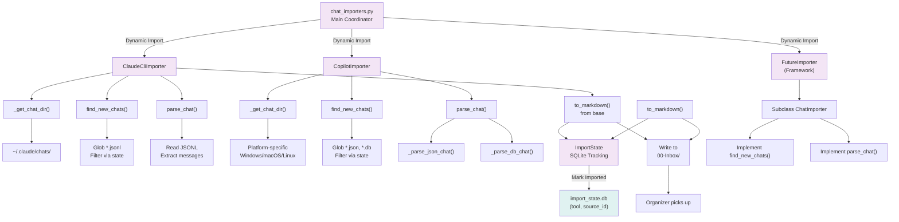
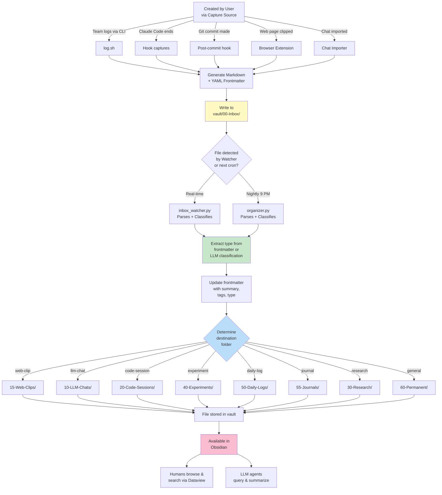
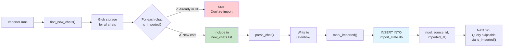
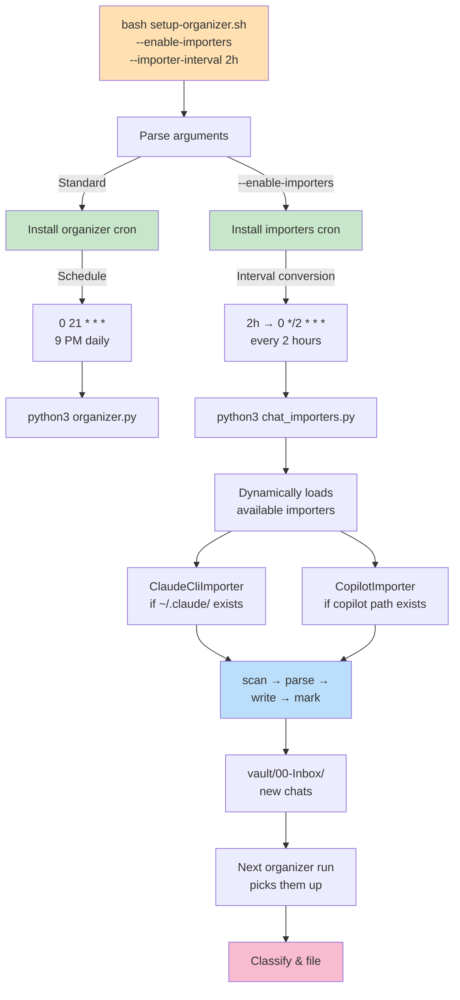
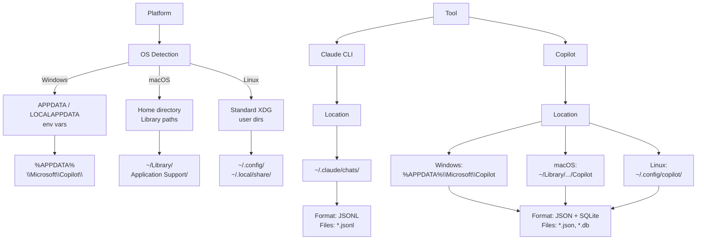
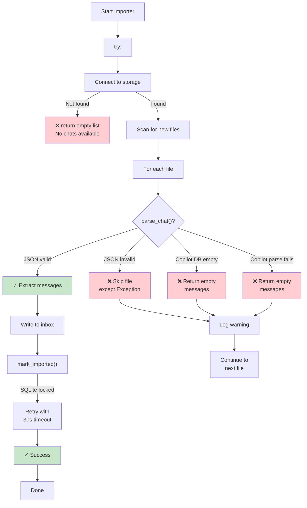
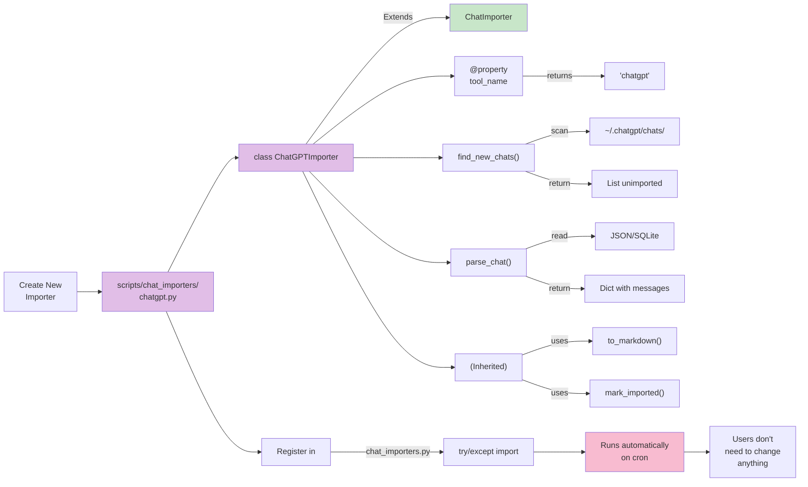

# Architecture Diagrams (Mermaid Format)

These diagrams show the chat importers and web clipper architecture in Mermaid format.

## 1. System Flow: End-to-End Pipeline

## 2. Browser Extension Architecture

## 3. Chat Importers: Classes & Flow

## 4. Data Flow: Single Note Lifecycle

## 5. State Tracking: Duplicate Prevention

## 6. Setup & Cron Integration

## 7. Chat Tool Storage Map

## 8. Error Handling & Robustness

## 9. Extensibility: Adding ChatGPT

---

## How to View These Diagrams

1. **In GitHub/Markdown viewer:** Diagrams render directly (requires Mermaid support)
2. **Live preview:** Use https://mermaid.live/ and paste the code
3. **Export to PNG:** Use the Mermaid CLI or online export
4. **In Obsidian:** Install the Mermaid plugin to view inline

